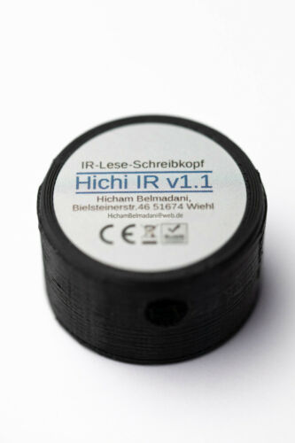

# ESPHome Smart Meter OBIS D0 Component

This repository adds support for smart meters with OBIS D0 interface to [ESPHome](https://esphome.io).

## Configuration

This component can be easily added as an [external component](https://esphome.io/components/external_components.html) to ESPHome.

Communication with the smart meter is done using UART, so you need to configure the [UART bus](https://esphome.io/components/uart.html#uart).

```yaml
external_components:
  - source: github://mampfes/esphome_obis_d0

uart:
  id: my_uart
  rx_pin: GPIO16
  baud_rate: 9600
  data_bits: 7
  parity: EVEN
  stop_bits: 1

obis_d0:
  id: my_sm
  uart_id: my_uart
  on_telegram:
    then:
      - logger.log: "telegram received"

sensor:
  - platform: obis_d0
    name: "Consumed Energy"
    obis_d0_id: my_sm
    obis_code: "1-0:1.8.0*255"
    unit_of_measurement: kWh
    accuracy_decimals: 4
    state_class: total_increasing
    device_class: energy
    value_regex: "\\d{6}\\.\\d{8}\\*kWh"

text_sensor:
  - platform: obis_d0
    name: "Device Identification"
    obis_d0_id: my_sm
    obis_code: "1-0:96.1.0*255"
    entity_category: diagnostic
    value_regex: "\\w{14}"

  - platform: obis_d0
    name: "Manufacturer ID"
    obis_d0_id: my_sm
    obis_code: "id"
    entity_category: diagnostic
    value_regex: "\\w+"
```

## Configuration Variables

### OBIS D0 platform

- **id** (Optional, [ID](https://esphome.io/guides/configuration-types.html#config-id)): Manually specify the ID used for code generation.
- **uart_id** (Optional, [ID](https://esphome.io/guides/configuration-types.html#config-id)): ID of the [UART Component](https://esphome.io/components/uart.html#uart) if you want to use multiple UART buses.

### Sensor

- **obis_code** (Required, string): Specify the OBIS code you want to retrieve data for from the device.
- **obis_d0_id** (Optional, [ID](https://esphome.io/guides/configuration-types.html#config-id)): ID of the *OBIS D0* Component if you want to manage multiple smart meters.
- **value_regex** (Optional, string): Regular expression to check the validity of the OBIS value. If received value does't match the regular expression, it will be discarded.
- **format** (Optional, string): Format of the OBIS value. Possible choices: `float`, `hex`. Defaults to `float`.
- **timeout** (Optional, [Time](https://esphome.io/guides/configuration-types.html#config-time)): Timeout after which value will be invalidated. Defaults to `5s`.
- All other options form [Sensor](https://esphome.io/components/sensor/index.html#config-sensor).

### Text Sensor

- **obis_code** (Required, string): Specify the OBIS code you want to retrieve data for from the device.
- All other options from [Text Sensor](https://esphome.io/components/text_sensor/index.html#config-text-sensor).

**NOTE**: There is one special OBIS code for text sensors:  
`id` returns the manufacturer identification at the beginning of an OBIS telegram (see example above).

### Automations

- **on_telegram** (Optional, [Automation](https://esphome.io/guides/automations.html#automation)): An automation to perform after a complete telegram (consisting of manufacturer identification and OBIS records) has been received.

---

## Hardware

A infrared reader is required to attach to the smart meter.

I am using the "IR-Lese-Schreibkopf" from Hicham Belmadani:



This device is sold on [ebay](https://www.ebay.de/itm/314015465828).

**NOTE:** I'm not responsible or anyhow associated with this offering!

---

## Supported Smart Meters

This section lists supported smart meters:

| Device | Status |
|-|-|
| [eBZ DD3 Drehstromzähler](doc/ebz_dd3.md) | Supported |
| [ISKRA MT174](doc/iskra_mt174.md) | Supported |
| [Logarex LK11 / LK13](doc/logarex.md) | Supported |

## Important Notes

### Error Detection

The OBIS D0 data format is a textual format based on ASCII characters without error detection and correction mechanisms except the parity bit. Parity errors are detected by the underlying UART layer, but in case of an error the characters are simply omitted - without further notifications to the application. This leads to corrupt readings being read which completly messes the statistics in Home Assistant. Therefore you can specify the expected format for each using regular expressions. If the received data doesn't match the regular expression (e.g. in case of parity error), the data will be discarded.

If anyone knows how to get a notification from the UART layer in case of an error - please let me know!

### ESP-01

Due to the size of the code, this component doesn't fit into an ESP-01 / ESP-01s.
