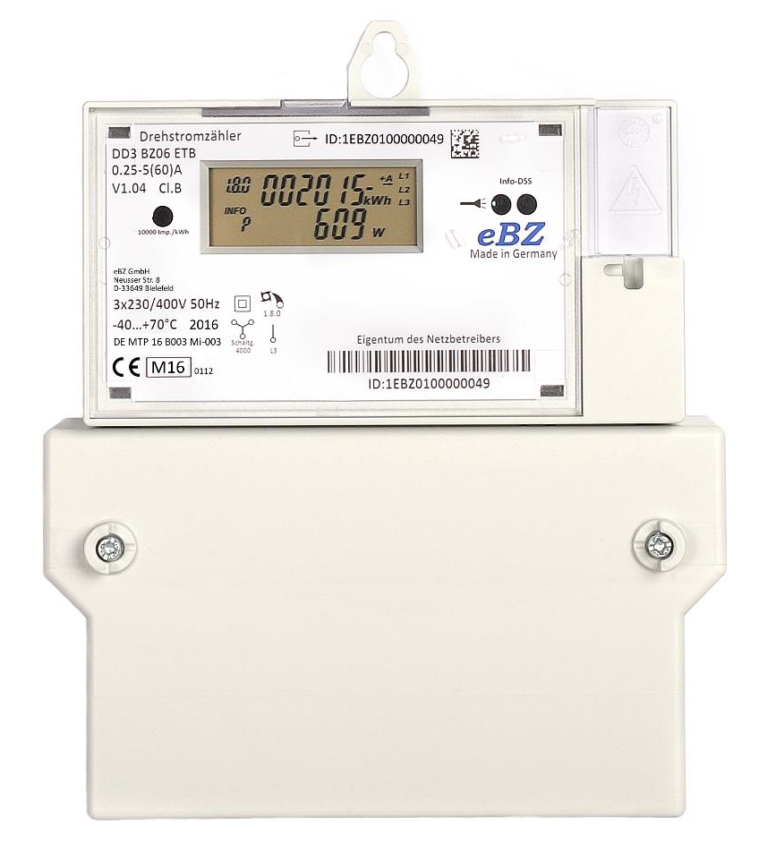

# eBZ DD3 Drehstromzähler



UART configuration: 9600 Baud, 7E1

This device has 2 D0 interfaces:

- **MSB-Schnittstelle** at the top\
  Outputs all readings (including in voltage) in full resolution.

- **Info-Schnittstelle** at the front\
  Outputs standard readings (excluding voltage) in limited resolution per default. To enable full resolution, the device has to be unlocked using a PIN. After a power blackdown the resolution switches back to limited resolution and has to be unlocked again.

## Example

```yaml
external_components:
  - source: github://mampfes/esphome_obis_d0

uart:
  id: my_uart
  rx_pin: GPIO16
  baud_rate: 9600
  data_bits: 7
  parity: EVEN
  stop_bits: 1

obis_d0:
  id: my_sm
  uart_id: my_uart

sensor:
  - !include common/sensor/wifi.yaml
  - !include common/sensor/uptime.yaml

  - platform: obis_d0
    name: "Consumed Energy"
    obis_d0_id: my_sm
    obis_code: "1-0:1.8.0*255"
    unit_of_measurement: kWh
    accuracy_decimals: 4
    state_class: total_increasing
    device_class: energy
    value_regex: "\\d\\d\\d\\d\\d\\d\\.\\d\\d\\d\\d\\d\\d\\d\\d\\*kWh"

  #  - platform: obis_d0
  #    name: "Consumed Energy Tariff 1"
  #    obis_d0_id: my_sm
  #    obis_code: "1-0:1.8.1*255"
  #    unit_of_measurement: kWh
  #    accuracy_decimals: 4
  #    state_class: total_increasing
  #    device_class: energy
  #    value_regex: "\\d\\d\\d\\d\\d\\d\\.\\d\\d\\d\\*kWh"

  #  - platform: obis_d0
  #    name: "Consumed Energy Tariff 2"
  #    obis_d0_id: my_sm
  #    obis_code: "1-0:1.8.2*255"
  #    unit_of_measurement: kWh
  #    accuracy_decimals: 4
  #    state_class: total_increasing
  #    device_class: energy
  #    value_regex: "\\d\\d\\d\\d\\d\\d\\.\\d\\d\\d\\*kWh"

  - platform: obis_d0
    name: "Provided Energy"
    obis_d0_id: my_sm
    obis_code: "1-0:2.8.0*255"
    unit_of_measurement: kWh
    accuracy_decimals: 4
    state_class: total_increasing
    device_class: energy
    value_regex: "\\d\\d\\d\\d\\d\\d\\.\\d\\d\\d\\d\\d\\d\\d\\d\\*kWh"

  #  - platform: obis_d0
  #    name: "Provided Energy Tariff 1"
  #    obis_d0_id: my_sm
  #    obis_code: "1-0:2.8.1*255"
  #    unit_of_measurement: kWh
  #    accuracy_decimals: 4
  #    state_class: total_increasing
  #    device_class: energy
  #    value_regex: "\\d\\d\\d\\d\\d\\d\\.\\d\\d\\d\\*kWh"

  #  - platform: obis_d0
  #    name: "Provided Energy Tariff 2"
  #    obis_d0_id: my_sm
  #    obis_code: "1-0:2.8.2*255"
  #    unit_of_measurement: kWh
  #    accuracy_decimals: 4
  #    state_class: total_increasing
  #    device_class: energy
  #    value_regex: "\\d\\d\\d\\d\\d\\d\\.\\d\\d\\d\\*kWh"

  - platform: obis_d0
    name: "Power"
    obis_d0_id: my_sm
    obis_code: "1-0:16.7.0*255"
    unit_of_measurement: W
    accuracy_decimals: 2
    state_class: measurement
    device_class: power
    value_regex: "-?\\d\\d\\d\\d\\d\\d\\.\\d\\d\\*W"

  - platform: obis_d0
    name: "Power L1"
    obis_d0_id: my_sm
    obis_code: "1-0:36.7.0*255"
    unit_of_measurement: W
    accuracy_decimals: 2
    state_class: measurement
    device_class: power
    value_regex: "-?\\d\\d\\d\\d\\d\\d\\.\\d\\d\\*W"

  - platform: obis_d0
    name: "Power L2"
    obis_d0_id: my_sm
    obis_code: "1-0:56.7.0*255"
    unit_of_measurement: W
    accuracy_decimals: 2
    state_class: measurement
    device_class: power
    value_regex: "-?\\d\\d\\d\\d\\d\\d\\.\\d\\d\\*W"

  - platform: obis_d0
    name: "Power L3"
    obis_d0_id: my_sm
    obis_code: "1-0:76.7.0*255"
    unit_of_measurement: W
    accuracy_decimals: 2
    state_class: measurement
    device_class: power
    value_regex: "-?\\d\\d\\d\\d\\d\\d\\.\\d\\d\\*W"

  - platform: obis_d0
    name: "Voltage L1"
    obis_d0_id: my_sm
    obis_code: "1-0:32.7.0*255"
    unit_of_measurement: V
    accuracy_decimals: 1
    state_class: measurement
    device_class: voltage
    value_regex: "\\d\\d\\d\\.\\d\\*V"

  - platform: obis_d0
    name: "Voltage L2"
    obis_d0_id: my_sm
    obis_code: "1-0:52.7.0*255"
    unit_of_measurement: V
    accuracy_decimals: 1
    state_class: measurement
    device_class: voltage
    value_regex: "\\d\\d\\d\\.\\d\\*V"

  - platform: obis_d0
    name: "Voltage L3"
    obis_d0_id: my_sm
    obis_code: "1-0:72.7.0*255"
    unit_of_measurement: V
    accuracy_decimals: 1
    state_class: measurement
    device_class: voltage
    value_regex: "\\d\\d\\d\\.\\d\\*V"

  - platform: obis_d0
    name: "Status"
    obis_d0_id: my_sm
    obis_code: "1-0:96.5.0*255"
    value_regex: "[0-9a-fA-F][0-9a-fA-F][0-9a-fA-F][0-9a-fA-F][0-9a-fA-F][0-9a-fA-F][0-9a-fA-F][0-9a-fA-F]"
    format: hex

  - platform: obis_d0
    name: "Time of operation"
    obis_d0_id: my_sm
    obis_code: "0-0:96.8.0*255"
    format: hex
    disabled_by_default: true
    entity_category: diagnostic
    value_regex: "[0-9a-fA-F][0-9a-fA-F][0-9a-fA-F][0-9a-fA-F][0-9a-fA-F][0-9a-fA-F][0-9a-fA-F][0-9a-fA-F]"

text_sensor:
  #  - platform: obis_d0
  #    name: "Owner Identification"
  #    obis_d0_id: my_sm
  #    obis_code: "1-0:0.0.0*255"
  #    entity_category: diagnostic
  #    value_regex: "\\w\\w\\w\\w\\w\\w\\w\\w\\w\\w\\w\\w\\w\\w"

  - platform: obis_d0
    name: "Device Identification"
    obis_d0_id: my_sm
    obis_code: "1-0:96.1.0*255"
    entity_category: diagnostic
    value_regex: "\\w\\w\\w\\w\\w\\w\\w\\w\\w\\w\\w\\w\\w\\w"
```