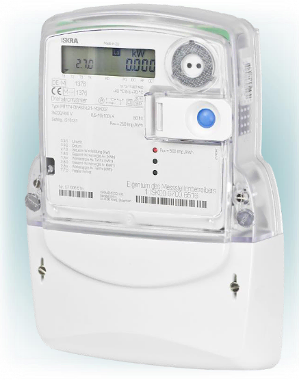

# ISKRA MT174



UART configuration: 300 Baud, 7E1

## Example

```yaml
external_components:
  - source: github://mampfes/esphome_obis_d0

uart:
  id: my_uart
  rx_pin: GPIO16
  tx_pin: GPIO17
  baud_rate: 300
  data_bits: 7
  parity: EVEN
  stop_bits: 1

obis_d0:
  id: my_sm
  uart_id: my_uart

## ---------------------------------------------------
# The device needs to be triggered to send out data. 
# We can use the integrated "interval" component for that:
## ---------------------------------------------------
interval:
  - interval: 60sec
    then:
      - uart.write:
          id: my_uart
          data: [0x2F, 0x3F, 0x21, 0x0D, 0x0A]

sensor:
  - !include common/sensor/wifi.yaml
  - !include common/sensor/uptime.yaml

  # 1.8.0(0011404.409*kWh) Positive active energy (A+) total [kWh]
  - platform: obis_d0
    obis_d0_id: my_sm
    name: "Verbrauch"
    obis_code: "1.8.10"
    unit_of_measurement: kWh
    accuracy_decimals: 3
    device_class: energy
    state_class: total_increasing
    value_regex: "\\d\\d\\d\\d\\d\\d\\d\\.\\d\\d\\d\\*kWh"

  # 1.8.1(0011404.409*kWh) Positive active energy (A+) in tariff HT [kWh]
  - platform: obis_d0
    obis_d0_id: my_sm
    name: "Verbrauch HT"
    obis_code: "1.8.1"
    unit_of_measurement: kWh
    accuracy_decimals: 3
    device_class: energy
    state_class: total_increasing
    value_regex: "\\d\\d\\d\\d\\d\\d\\d\\.\\d\\d\\d\\*kWh"

  # 1.8.2(0023813.725*kWh) Positive active energy (A+) in tariff NT [kWh]
  - platform: obis_d0
    obis_d0_id: my_sm
    name: "Verbrauch NT"
    obis_code: "1.8.2"
    unit_of_measurement: kWh
    accuracy_decimals: 3
    device_class: energy
    state_class: total_increasing
    value_regex: "\\d\\d\\d\\d\\d\\d\\d\\.\\d\\d\\d\\*kWh"

  # 2.8.0(0015608.962*kWh) Negative active energy (A-) total [kWh]
  - platform: obis_d0
    obis_d0_id: my_sm
    name: "Einspeisung"
    obis_code: "2.8.0"
    unit_of_measurement: kWh
    accuracy_decimals: 3
    device_class: energy
    state_class: total_increasing
    value_regex: "\\d\\d\\d\\d\\d\\d\\d\\.\\d\\d\\d\\*kWh"

  # 2.8.1(0015608.962*kWh) Negative active energy (A-) in tariff T1 [kWh]
  - platform: obis_d0
    obis_d0_id: my_sm
    name: "Einspeisung T1"
    obis_code: "2.8.1"
    unit_of_measurement: kWh
    accuracy_decimals: 3
    device_class: energy
    state_class: total_increasing
    value_regex: "\\d\\d\\d\\d\\d\\d\\d\\.\\d\\d\\d\\*kWh"

  # 2.8.2(0000900.569*kWh)  Negative active energy (A-) in tariff T2 [kWh]
  - platform: obis_d0
    obis_d0_id: my_sm
    name: "Einspeisung T2"
    obis_code: "2.8.2"
    unit_of_measurement: kWh
    accuracy_decimals: 3
    device_class: energy
    state_class: total_increasing
    value_regex: "\\d\\d\\d\\d\\d\\d\\d\\.\\d\\d\\d\\*kWh"

text_sensor:
  # 0.9.2(0230223) Date (1YY.MM.DD)
  - platform: obis_d0
    name: "MT174Mdate"
    internal: true
    obis_d0_id: my_sm
    obis_code: "0.9.2"
    value_regex: "\\d\\d\\d\\d\\d\\d\\d"
    filters:
      - prepend: "2"
    on_value:
      then:
        - lambda: |-
            std::string result = x.substr(0,4) + "-" + x.substr(4,2) + "-" + x.substr(6,2);
            id(thedate).publish_state(result);


  # 0.9.1(130203)  Current time (hh:mm:ss)
  - platform: obis_d0
    name: "MT174Mtime"
    internal: true
    obis_d0_id: my_sm
    obis_code: "0.9.1"
    value_regex: "\\d\\d\\d\\d\\d\\d"
    on_value:
      then:
        - lambda: |-
            std::string result = x.substr(0,2) + ":" + x.substr(2,2) + ":" + x.substr(4,2);
            id(thetime).publish_state(result);

  - platform: template
    name: Messdatum
    id: thedate
    entity_category: "diagnostic"

  - platform: template
    name: Messzeit
    id: thetime
    entity_category: "diagnostic"
```
